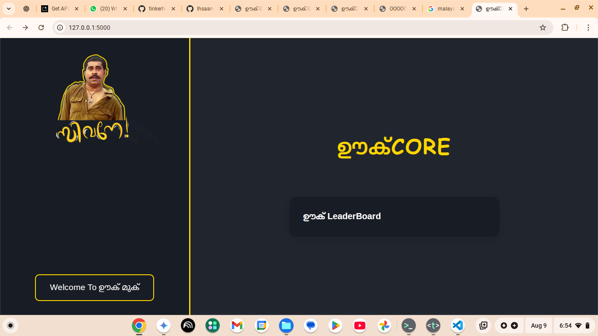
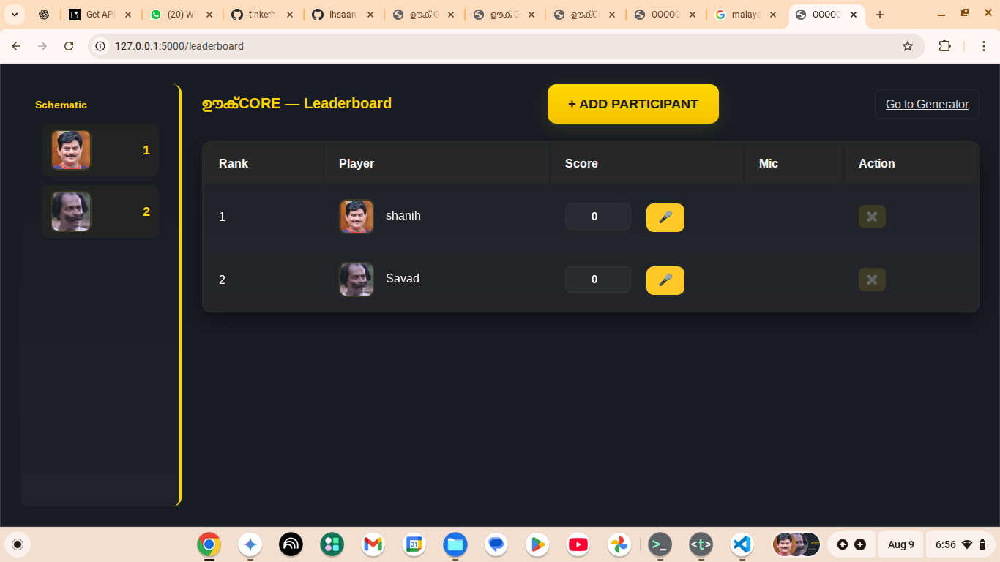

# Ūku Core 🎯

## Basic Details

**Team Name:** Horsemen  
**Team Members**  
- **Team Lead:** K S Mohammed Ihsaan - Government Engineering College Idukki  
- **Member 2:** Salih Mubarak - Government Engineering College Idukki


---

## Project Description  
Ūku Core is a **sarcasm calculator** that measures sarcasm levels in speech and displays them on a fun, animated leaderboard.  
Players take turns speaking into a mic, and within 6 seconds, they get a score between 60–100. Totally scientific. (Not really.)

---

## The Problem (that doesn't exist)  
Tired of people not knowing just how sarcastic you are?  
Ever wished there was a way to **quantify** your sarcasm for bragging rights?  
We felt the same—until we built Ūku Core.  

---

## The Solution (that nobody asked for)  
By combining **speech recognition**, **random number magic**, and **a leaderboard with avatars**,  
we created the world’s most *uselessly amazing* tool to measure sarcasm.  

---

## Technical Details

### For Software:
- **Languages used:** Python, JavaScript, HTML, CSS  
- **Frameworks used:** Flask  
- **Libraries used:** Flask, Web Speech API, Random module  
- **Tools used:** VS Code, Git, Browser DevTools  

### For Hardware:
- A computer/laptop  
- A working microphone  
- (Optional) A sense of humor 😏

---

## Implementation
<h3>SCREENSHOT</h3>




### Installation
```bash
git clone https://github.com/edumoh8/ooku-core.git

pip install -r requirements.txt
python wholecode.py


..
